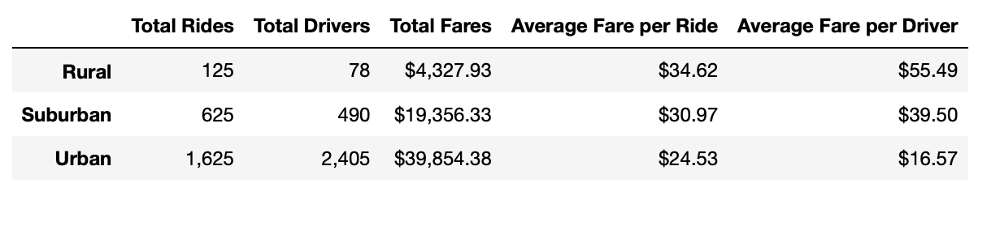

# PyBer_Analysis
## Overview
The purpose of this projectcreate a DataFrame of the ride-sharing data by city type. Then, using Pandas and Matplotlib to create a multiple-line graph that shows the total weekly fares for each city type,which help improve access to ride-sharing services and determine affordability for underserved neighborhoods.

## Results
I have created a statistical overview and summary:

By reviewing the summary we can see that there are several key findings:
1. Urban cities has the highest ridership demand and rural cities has the least
2. Urban cities has the most drivers and rural cities has the least
3. Urban revenue is around $39,850, which is almost 9 times of the rural(around $4,330).
4. The order of average fare in rider and driver are same. The urban is the cheapest, and rural is the most expensive.
5. the demand of ride in rural and suburban is lower than the number of drivers
## Summary
Based on the above the analysis, my recommendation to Pyter is decreasing the number of urban driver, because the ride demand is lower than the number of driver, which cause unhealthy competition. Also, Increasing the driver in rural and suburban meet the demands of ride, beacuase the average fare in rural area is highest(take trip over a long distance). These changes can result a increse of your profit.
